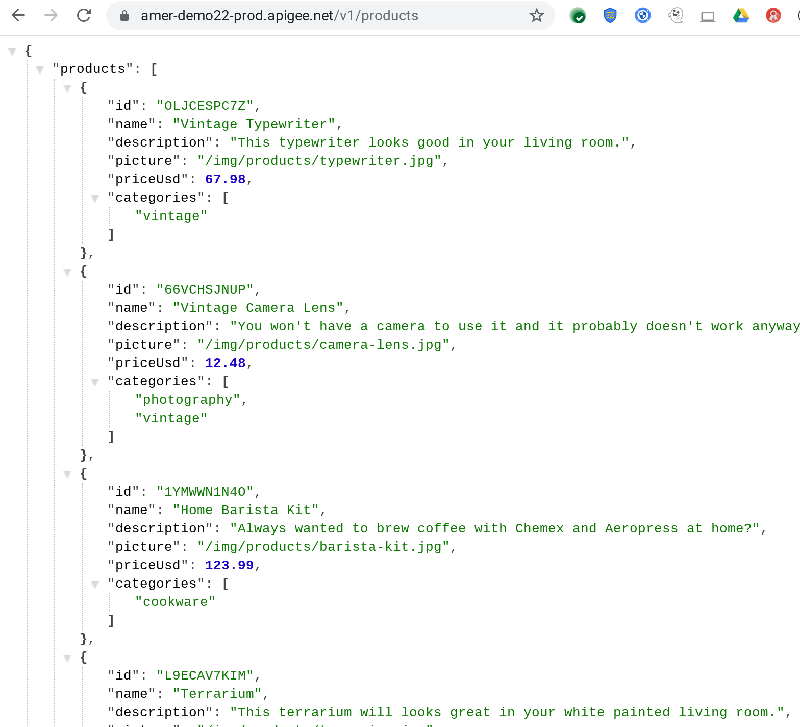
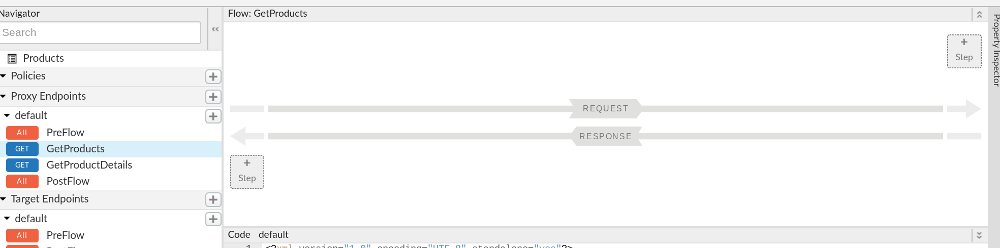
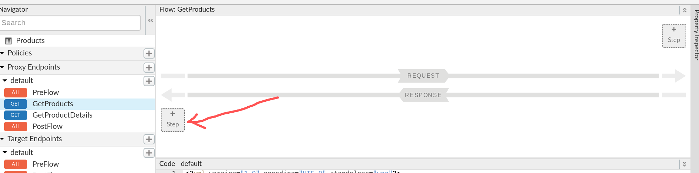
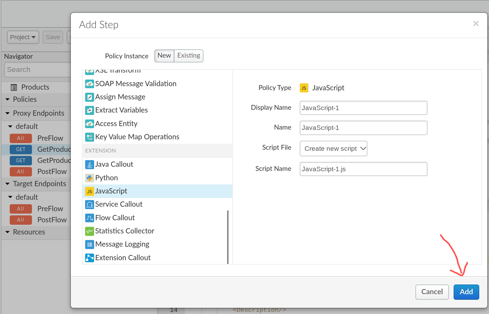
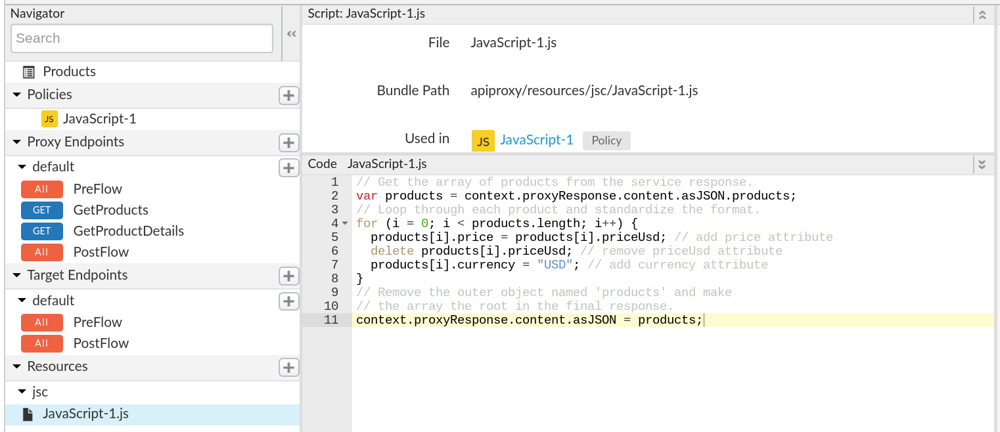
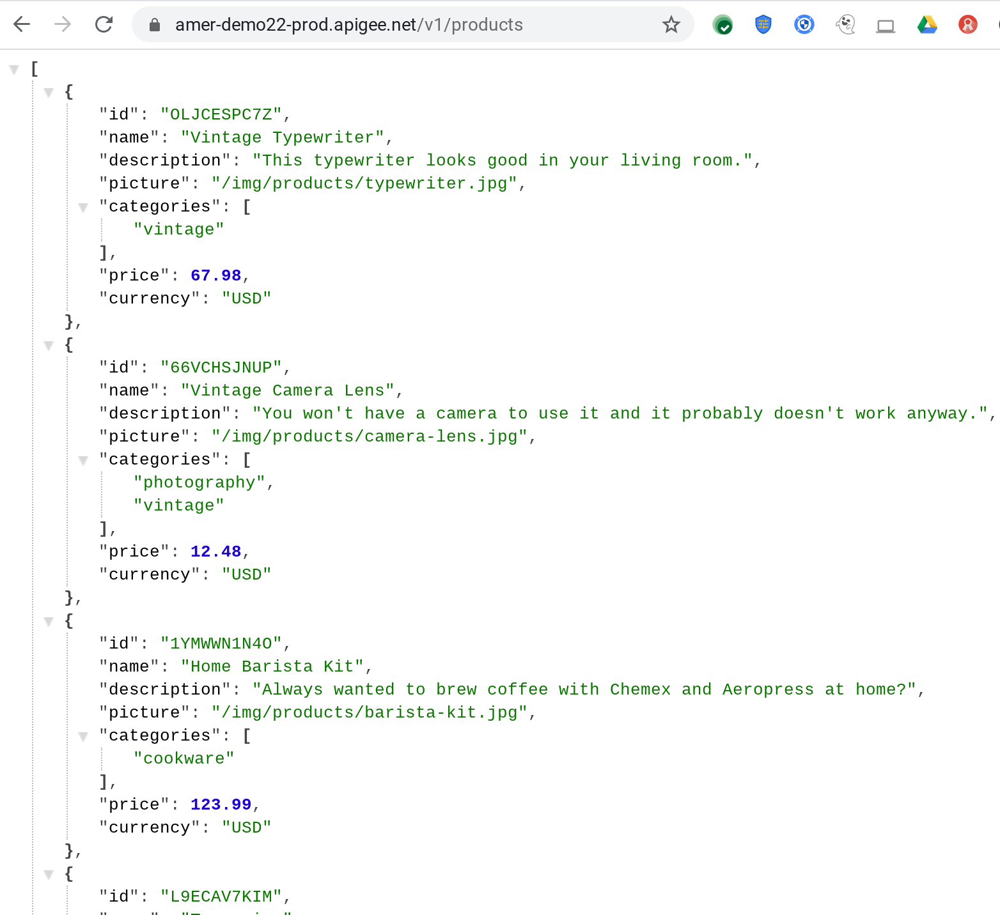

# Transformation : JavaScript and JSON-to-XML 

*Duration : 30 mins*

*Persona : API Team*

# Use case

You have a backend service that returns a JSON payload, but the schema doesn't match what you've published to consumers. Also, a potential business partner has asked that you provide access to the same data in XML format. You don’t own the backend service, and even if you did, by the time your team changed the backend, and it passed all your enterprise integration tests, you would have lost the partnership opportunity.

# How can Apigee Edge help?

The [JavaScript policy](https://docs.apigee.com/api-platform/reference/policies/javascript-policy) in Apigee lets you add custom JavaScript code that executes within the context of an API call. In your custom JavaScript code, you can use the objects, methods, and properties of the Apigee object model, which lets you to read or manipulate virtually any aspect of the HTTP request (from the client) or response (from the backend service), along with a wide breadth of rich contextual information that Apigee makes available. It is especially powerful for making tweaks to the format of a JSON (JavaScript Object Notation) payload.

The [JSON to XML Policy](http://docs.apigee.com/api-services/reference/json-xml-policy) in Apigee converts request or response messages from JSON to XML.  The default configuration should work in most cases but the policy gives you fine-grained control over all of the conversion features, such as namespaces, attributes, array elements, null values, separators, and how to handle invalid characters.

In this lab, you will modify an existing API Proxy to 1) reformat the default JSON response format from the backend service, and 2) allow the API to return XML to clients who request it.  To achieve this you will perform the following -

1. Adjust the response JSON using a few simple JavaScript lines.

2. If a request has an Accept header of "application/xml"

    1. Remove the (XML) Accept header to allow the target to return JSON

    2. Implement the [JSON to XML Policy](http://docs.apigee.com/api-services/reference/json-xml-policy) to convert the response body from JSON to XML

    3. Inject a response header of "Content-type: application/xml".

# Pre-requisites

For this lab, you will need an API Proxy that returns JSON.  If you do not have an API Proxy available for this lab, revisit the lab "API Design : Create a Reverse Proxy with OpenAPI Specification" and then return here to complete these steps.

# Instructions

## Create an Open API Specification

During the course of this lab, the sample HTTP service we will expose as an API endpoint, is the Hipster Products service located at [http://cloud.hipster.s.apigee.com/products](http://cloud.hipster.s.apigee.com/products).
First, we are going to design and create an OpenAPI specification for the different resource endpoints, i.e. /products and /products/{productId}. 

1. Go to [https://apigee.com/edge](https://apigee.com/edge) and log in. This is the Edge management UI. 

2. Select **Develop → Specs** in the side navigation menu


3. As we have a pre-designed sample of the spec available for this lab, we will be importing it into your Apigee Org's Spec Store. Click **+Spec**. Click on **Import URL** to add a new spec from existing source.


4. Enter spec details. Replace **{your-initials}** with the initials of your name.

   * File Name: **{your-initials}**_hipster_products_api_spec
   * URL: [https://raw.githubusercontent.com/aliceinapiland/apijam/master/Module-1/Resources/products-catalog-spec.yaml](https://raw.githubusercontent.com/aliceinapiland/apijam/master/Module-1/Resources/products-catalog-spec.yaml)


5. Verify the values and click **Import**. Spec has been imported into Apigee Edge & Ready to use. You should see your spec in the list. For example,


6. Click on **{your-initials}**\_hipster_products_api_spec from the list to access Open API spec editor & interactive documentation that lists API details & API Resources.


## Create an API Proxy

1. It’s time to create Apigee API Proxy from Open API Specification. Click on **Develop → API Proxies** from side navigation menu.


2. Click **+Proxy** The Build a Proxy wizard is invoked. 


3. Select **Reverse proxy**, Click on **Use OpenAPI** below reverse proxy option.


4. You should see a popup with list of Specs. Select **{your-initials}**\_hipster_products_api_spec and click **Select.** 


5. Enter details in the proxy wizard. Replace **{your-initials}** with the initials of your name. 

    * Proxy Name: **{your_initials}**\_Hipster-Products-API

    * Proxy Base Path: /v1/**{your_initials}**\_hipster-products-api

    * Existing API: Observe the field value which is auto filled from OpenAPI Spec.


6. Verify the values and click **Next**.

7. Select **Pass through (none)** for the authorization in order to choose not to apply any security policy for the proxy. Click Next. 


8. You can select, de-select list of API Proxy Resources that are pre-filled from OpenAPI Spec. Select all & Click on **Next**


9. Go with the **secure Virtual Host** configuration. Ensure that the **default** one is unchecked.


10. Ensure that only the **test** environment is selected to deploy to and click **Create and Deploy** 


11. Once the API proxy is created and deployed click **Edit Proxy** to view your proxy in the proxy editor. 


12. *Congratulations!* ...You have now built a reverse proxy for an existing backend service. You should see the proxy **Overview** tab.


13. Invoke the API at Apigee to see the default JSON format coming from the backend service.



## Add transformation of the JSON response

1. Ensure the flow named GetProducts is selected, which handles GET requests that retrieve the complete collection rather than a single product.



2. Click the button to add a step to the response flow



3. Select the JavaScript policy and add it



4. Open the new .js file created for the new JavaScript policy and paste the following

```JavaScript
// Get the array of products from the service response.
var products = context.proxyResponse.content.asJSON.products;
// Loop through each product and standardize the format.
for (i = 0; i < products.length; i++) {
  products[i].price = products[i].priceUsd; // add price attribute
  delete products[i].priceUsd; // remove priceUsd attribute
  products[i].currency = "USD"; // add currency attribute 
}
// Remove the outer object named 'products' and make
// the array the root in the final response.
context.proxyResponse.content.asJSON = products;
```



5. Save the changes and ensure they are deployed


6. Invoke the URL to see the tranformed JSON response payload



### Proxy source code

The source code for the proxy that we have constructed so far can also be found [here](./revisions/rev-1_json-transform), for reference.  

## Add support for XML format

1. 